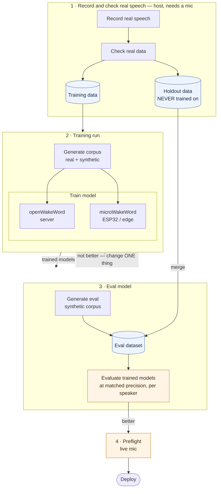

# Pipeline architecture

**This is the desired end state, not a description of what exists today.** Where the
repo diverges from it is listed at the bottom.

As specified:

> record real, including hold outs data -> check real data -> training runs [generate
> corpus (including synthetics) -> train model [oww, mww] ] -> generate eval synethtic
> corpus merge with hold outs -> eval trained models -> preflight check with live mic



The two things this shape is built around: **the holdout leaves step 1 and goes
straight into the eval dataset**, never through training; and **evaluation feeds back
into the training run**, because that loop is the pipeline — seventeen runs of it so
far.

## Two invariants the diagram depends on

**The holdout must postdate the model.** `train.py` globs `my_real_samples/`
recursively, so scoring against it reports training accuracy — it overstated detection
by ~10 points and hid a much larger gap on run-on speech before anyone noticed. That is
why step 1 produces *two* stores rather than one that gets split later, and why the
holdout edge bypasses step 2 entirely.

**The two negative wordlists must not overlap.** Training negatives and the eval corpus
the false-accept gates are scored on are generated separately and kept disjoint. A
phrase in both turns a generalisation measurement into a memorisation one.

## Where the repo diverges from this today

| step | gap |
|---|---|
| 2 · train | The microWakeWord corpus has no run-on positives and is Piper-only. On the openWakeWord side run-ons took held-out run-on detection from 5% to the 80s, and two TTS engines beat one by the largest margin since run 10. |
| 3 · evaluate | openWakeWord is not evaluated on the deployment runtime. `pyopen-wakeword` is TFLite-only and the ship candidates are `.onnx`, so they score through `openwakeword.model.Model` — comparable with `tuning.md`, not with a device. Converting them closes it. |
| 3 · evaluate | No window-alignment measurement for microWakeWord. `eval/check_model_alignment.py` is openWakeWord-only, and its framing does not transfer to a streaming detector with a sliding-window average. |
| 4 · preflight | **No microWakeWord path at all.** `test_model.py` loads through `openwakeword.model.Model`, so a microWakeWord model cannot currently be preflighted on a live mic — the last gate before deploy does not cover half the diagram. |

## File layout

**Implemented.** Before this, fourteen scripts sat at the repo root in no particular
order and the only packages that existed (`corpus/`, `mww/`, `eval/`) had each been
created for a different reason. One directory per pipeline step now:

```
record/                     1 · record and check
  record_samples.py             was record_real_sample/
  check_alignment.py            was root
  pyproject.toml, uv.lock       its own uv env - kept together

train/                      2 · training run
  corpus/                       was root corpus/ - shared by both trainers
    augment.py negatives.py positives.py piper.py real.py
  oww/
    train.py                    was root
    onnx2tflite.py              was root
  mww/                          was root mww/
    corpus.py features.py config.py train.py manifest.py

eval/                       3 · eval model
  generate_negatives.py         was root - builds the eval corpus
  generate_positives.py         was root - builds the eval corpus
  backends.py                   already here
  eval_model.py                 was root
  compare_models.py             was root
  check_model_alignment.py      already here

preflight/                  4 · preflight
  test_model.py                 was root

tools/                      not in the diagram - one-off measurement
  audit_voices.py bench_tts.py measure_voice_f0.py

patches/                    unchanged
docker/                     Dockerfile, Dockerfile.mww, Dockerfile.piper, Dockerfile.eval
scripts/                    setup.sh setup-data.sh setup-mww-data.sh run-training.sh
```

**Data directories do not move.** `my_real_samples/`, `my_real_samples_holdout/`,
`negatives_tts/`, `positives_tts/`, `my_custom_model/`, `data/`. They are named in
compose mounts, in `train.py`'s globbing, in the skill, and in several hundred lines of
`tuning.md`. Renaming them buys tidiness and risks the one thing this repo cannot
afford to get wrong, which is knowing which corpus a number came from. Separate
decision, separate day.

### Why `generate_*.py` belong under `eval/`

They build the corpus the false-accept gates are scored on — not training data.
`corpus/negatives.py` already says so about itself: *"Kept deliberately DISJOINT from
the eval corpus in generate_negatives.py."* That disjointness is what keeps the gates a
generalisation measurement rather than a memorisation one, and today the two files it
holds between sit in unrelated places with nothing structural saying they are a pair.
`train/corpus/negatives.py` beside `eval/generate_negatives.py` makes the rule visible
in the tree.

Everything runs as a module from the repo root: `python -m train.oww.train`,
`python -m eval.compare_models`, `python -m train.mww.manifest`.

### What broke, and the fix

Not a big list, but the first one was a trap rather than an inconvenience, and a
second of the same kind turned up during the move.

| what | why | fix |
|---|---|---|
| **`train.py` chdir** | `train.py:47` did `os.chdir(Path(__file__).parent)` at import. Moved to `train/oww/`, the working directory becomes `train/oww/` and every relative path it uses — `data/`, `my_real_samples/`, `my_custom_model/` — resolves under there instead of the repo root. It does not error; it builds a corpus in the wrong place. | anchored to the repo root: `REPO_ROOT = Path(__file__).resolve().parents[2]` |
| **the same bug in the shell scripts** | found during the move, not predicted above. `run-training.sh` and `setup.sh` both did `cd "$(dirname "$0")"`. From `scripts/` that lands in `scripts/`, where there is no compose file and no `data/`. Same failure shape as the chdir: wrong directory, no error. | `cd "$(dirname "$0")/.."` |
| Dockerfile `COPY` | `COPY corpus/ ./corpus/`, `COPY train.py .`, `COPY mww/ ./mww/` in `Dockerfile` and `Dockerfile.mww` | follow the moves; keep the in-image layout flat if that is simpler than mirroring |
| compose mounts | the `eval` service mounts `eval_model.py` and `compare_models.py` as individual files | collapses to the single `./eval:/app/eval:ro` mount that is already there |
| invocation | `python eval_model.py` becomes `python -m eval.eval_model`, etc. | update README, CLAUDE.md and the `evaluate-run` skill together |
| `tuning.md` commands | past run entries contain the old paths | **do not rewrite them.** It is a lab notebook; the commands were true when run. Add one dated line at the top pointing at the move commit |

Filenames stay as they are — `eval/eval_model.py`, not `eval/model.py`. `tuning.md`
refers to these scripts by name throughout, and being able to grep the notebook against
the tree is worth more than removing a stutter.

### The gate

`git mv` throughout, so history follows every file. Then the repo's own discipline:
**the same evaluation was run before and after and required to produce identical
output.** It did — `compare_models.py` on `d1bb9f4` and the microWakeWord manifest,
against jay's holdout with `--sweep`, byte-for-byte identical across the move. A reorg
that quietly changes a path is exactly the class of bug that produced a confident wrong
answer eight times in `tuning.md`, and it was cheap to rule out.

Also verified after the move: `eval.eval_model`, `eval.check_model_alignment`,
`eval.backends --model`, `train.mww.manifest`, the `eval` image build, and the import
check the trainer and mWW images run at build time (`import train.corpus.augment, ...`),
exercised in the eval image since those two are CUDA/amd64 and cannot build on the Mac.

`tuning.md`'s run sections keep their old paths, with one note at the top saying so.
